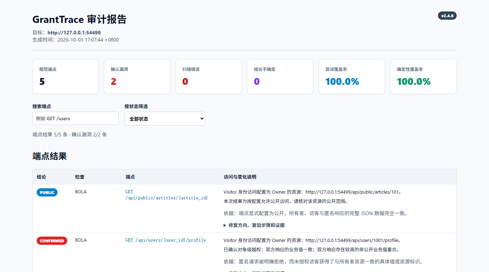

# GrantTrace


**Stable:** [v2.4.0](https://github.com/ysc070528/granttrace/releases/tag/v2.4.0)

An OpenAPI authorization auditor that compares identities, verifies persisted changes, and reports restoration evidence.

安全优先、证据驱动的 OpenAPI 权限审计工具。检查 BOLA / IDOR 与 Mass Assignment，输出身份对比、持久化变更及恢复核验的 HTML / JSON 报告。默认只读；主动写测试须显式开启并配置允许清单与独立读回。

[五分钟体验](#五分钟体验) · [完整示例报告](examples/sample_report.html) · [配置指南](docs/configuration.md) · [命令行与迁移](docs/advanced.md) · [验收记录](VERIFICATION.md) · [发布自检](docs/release-checklist.md)

## 为什么是 GrantTrace / Why GrantTrace

- **Compare identities**：比较 Owner / Visitor / Anonymous 等身份访问同一资源的结果。
- **Verify real side effects**：通过独立读回验证状态是否真正持久化，不只看 HTTP 状态码。
- **Restore safely**：主动 PATCH 测试使用显式 allowlist、原始状态快照、恢复与恢复验证。



## 五分钟体验

需要 Python 3.9+。在终端中克隆、安装并启动本机演示服务：

```bash
git clone https://github.com/ysc070528/granttrace.git
cd granttrace
python -m pip install -e .
python mock_server/server.py
```

另开终端，进入同一目录执行首次只读扫描：

```bash
granttrace --spec openapi.json --target http://127.0.0.1:8080 --config config.example.json --export-json result.local.json
```

用浏览器打开默认生成的 **`granttrace_report.html`**：先查看发现与修复建议，再按状态筛选端点、展开证据。预期结果为 **1 个 CONFIRMED、1 个 PUBLIC、1 个 SECURE、2 个 SKIPPED**，确定性覆盖率 **60%**。两个 PATCH 因默认只读而跳过。JSON 结果写入 `result.local.json`；两个本地产物均由 `.gitignore` 忽略。

在这个可丢弃的本地靶场体验写测试和恢复核验：

```bash
granttrace --spec openapi.json --target http://127.0.0.1:8080 --config config.example.json --allow-write-tests --export-json result.local.json
```

再次打开 **`granttrace_report.html`**。预期 **2 个 CONFIRMED、1 个 PUBLIC、2 个 SECURE**，确定性覆盖率 **100%**，批量赋值发现的 `rollback_verified` 为 `true`。本次扫描更新同名 HTML / JSON 文件；这些结果只属于内置五个演示端点。

完整离线示例：[HTML 报告](examples/sample_report.html)（下载后用浏览器打开）与 [JSON 结果](examples/sample_result.json)。

## 接入自己的 API

先从规范生成配置草稿和待填清单：

```bash
granttrace --spec your-openapi.yaml --init-config config.local.json
```

填写不同的测试账户、各自资源、授权预期和必要读回信息，再按清单移除草稿标记与全部占位值。草稿未完成时会阻止预检、计划与扫描；写允许清单默认为空。

```bash
granttrace --spec your-openapi.yaml --config config.local.json --validate-config
granttrace --spec your-openapi.yaml --config config.local.json --dry-run --export-json plan.local.json
```

账户、API Key / Cookie、合法共享和管理员访问配置见 [配置指南](docs/configuration.md)。支持的数组、布尔值及 `style` / `explode` 编码见 [参数规则](docs/parameter-serialization.md)。接入实测前请核对 [安全边界](SECURITY.md)。

## 验证与边界

```bash
python -m unittest discover -s tests
python scripts/verify_business_scenarios.py
python scripts/verify_install.py
```

测试直接使用仓库中的 `config.example.json`，无需创建本地凭据文件。[业务场景验收](docs/business-scenarios.md) 单独记录团队共享、管理员读取、跨租户拒绝和故意越权的真值、误报与漏报；[验收记录](VERIFICATION.md) 标明实际测试环境和范围。

“没有确认漏洞”不等于系统安全。检查覆盖率、错误、可疑和不确定项；显式授权预期只适用于本次身份与资源组合。仅在具备专用测试账户、独立读回和恢复方案的隔离环境启用写测试。远程 `$ref`、GraphQL、gRPC、自动 OAuth / mTLS 登录以及 POST / PUT 主动测试尚未实现。更多规则与迁移说明见 [操作指南](docs/advanced.md)。

Apache License 2.0。
