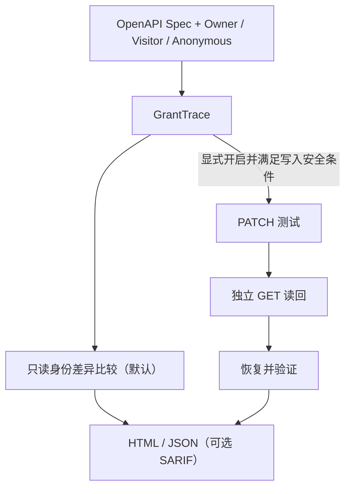

# GrantTrace


[](https://pypi.org/project/granttrace/)


**源码 / 包元数据版本：2.5.2** · [GitHub Releases](https://github.com/ysc070528/granttrace/releases) · [PyPI](https://pypi.org/project/granttrace/)

Windows 便携版已正式提供；已发布版本与下载资产以官方 GitHub Release / PyPI 页面实际列出的版本为准。

An OpenAPI authorization auditor that compares identities, verifies persisted changes, and reports restoration evidence.

安全优先、证据驱动的 OpenAPI 权限审计工具。检查 BOLA / IDOR 与 Mass Assignment，输出身份对比、持久化变更及恢复核验的 HTML / JSON 报告。默认只读；主动写测试须显式开启并配置允许清单与独立读回。

默认扫描会在请求前跳过具有明显状态变更语义的 GET，包括独立读回；静态规则无法保证发现所有副作用，仍需人工核对规范和计划。拒绝响应、授权证据及覆盖率的具体边界见 [授权审计加固说明](docs/authorization-audit-hardening.md)。

仅对明确获得授权的系统进行测试；主动写测试仅应在可丢弃、隔离的测试资源上启用。

## Windows 用户：解压后双击体验

**推荐 Windows 10 / 11（64 位），便携包无需安装 Python。** 从官方 [GitHub Release](https://github.com/ysc070528/granttrace/releases/latest) 选择对应版本下载：

1. 下载 Release 中的 Windows x64 ZIP（2.5.2 对应文件名为 **`GrantTrace-v2.5.2-Windows-x64.zip`**），将整个 ZIP 解压到一个普通文件夹。
2. 打开解压后的文件夹，双击 **`Start-Demo.bat`**；保留旁边的程序和依赖文件。
3. 查看自动打开的 HTML 报告；若未打开，按启动器打印的 HTML 路径手动打开。HTML / JSON 保存在解压目录的 `granttrace-demo/session-*/run-*/`。Demo 只使用内置、可丢弃的 `127.0.0.1` 靶场，结束时关闭靶场并核验数据恢复。

不要直接在 ZIP 内运行启动器。便携包版本以包内 `README.txt` 和 `.\granttrace.exe --version` 为准；程序、启动器和报告在解压目录内使用，不需要修改系统 PATH。维护者的构建与验收步骤见 [Windows 便携包说明](docs/windows-portable.md)。

Windows 便携程序尚未进行代码签名，部分系统可能显示 Microsoft Defender SmartScreen 或“发布者未知”提示。请只从官方 GitHub Release 下载，并使用同一 Release 的 **`SHA256SUMS.txt`** 核对完整性。

## macOS / Linux 用户：使用 Python 安装

需要 **Python 3.9+**；当前不提供 macOS / Linux standalone binary，Windows ZIP 仅适用于 Windows。
已有 Python 的 Windows 用户也可沿用此方式：

```bash
python -m pip install --upgrade granttrace
granttrace --version
granttrace demo
```

[Python 五分钟体验](#五分钟体验) · [完整示例报告](https://github.com/ysc070528/granttrace/blob/main/examples/sample_report.html) · [配置指南](https://github.com/ysc070528/granttrace/blob/main/docs/configuration.md) · [命令行与迁移](https://github.com/ysc070528/granttrace/blob/main/docs/advanced.md) · [验收记录](https://github.com/ysc070528/granttrace/blob/main/VERIFICATION.md) · [发布自检](https://github.com/ysc070528/granttrace/blob/main/docs/release-checklist.md)

## 为什么是 GrantTrace / Why GrantTrace

- **Compare identities**：比较 Owner / Visitor / Anonymous 等身份访问同一资源的结果。
- **Verify real side effects**：通过独立读回验证状态是否真正持久化，不只看 HTTP 状态码。
- **Restore safely**：主动 PATCH 测试使用显式 allowlist、原始状态快照、恢复与恢复验证。

## 10 秒看懂 GrantTrace




## 五分钟体验

使用上方 Windows 启动器或 Python 安装命令，即可体验内置 `granttrace demo`。

安装后可在任意目录运行，无需 clone、准备配置、另开终端或访问外部 API。Demo 自动启动动态端口的 `127.0.0.1` 靶场，比较身份访问、演示 BOLA / IDOR 与 Mass Assignment，并通过独立读回与恢复核验展示 PATCH 测试证据。**主动写操作仅发生在内置、可丢弃的本机靶场**；demo 不接受外部 target 或用户凭据，结束时关闭靶场。

HTML / JSON 报告保留在当前目录的 `granttrace-demo/` 唯一子目录，终端会输出绝对路径，不覆盖已有报告。可选用 `granttrace demo --output-dir PATH` 指定报告父目录，或 `granttrace demo --read-only` 仅体验只读身份访问，发送 **0 PATCH**。

完整离线示例：[HTML 报告](https://github.com/ysc070528/granttrace/blob/main/examples/sample_report.html)（下载后用浏览器打开）与 [JSON 结果](https://github.com/ysc070528/granttrace/blob/main/examples/sample_result.json)。

## 接入自己的 API

推荐按以下顺序首次接入；前四步只处理本地文件：

1. **生成草稿和清单**：

```bash
granttrace --spec your-openapi.yaml --init-config config.local.json
```

2. **人工填写并核对**：打开配置和 checklist，填写不同的 Owner / Visitor 测试账户、可丢弃资源与业务授权预期。候选 PATCH 字段和 GET 路径只是接口合同提示；确认所需读回映射，删除不用的读回草稿，替换全部 `__GRANTTRACE_INPUT__:` 占位值，最后移除 `_granttrace_draft`。草稿未完成时会阻止验证、计划与扫描；`write_allowlist` 默认为空。

3. **离线验证配置与规范**，检查终端中的 scope、模式、警告和下一步：

```bash
granttrace --spec your-openapi.yaml --config config.local.json --validate-config
```

4. **生成并人工检查本地计划**；dry-run 发送 **0 请求**：

```bash
granttrace --spec your-openapi.yaml --config config.local.json --dry-run --export-json plan.local.json
```

5. **第一次真实扫描保持只读**：确认计划后，将下例地址替换为已授权的测试目标；这一步会发送读取请求，默认 **0 PATCH**。

```bash
granttrace --spec your-openapi.yaml --target https://authorized-test.example \
  --config config.local.json --export-json result.local.json
```

6. **以后需要时再考虑主动 PATCH**：只有在专用可丢弃资源、独立 GET readback、字段映射、一致性和恢复路径均经人工确认后，才配置明确的 `write_allowlist` 并在真实扫描中单独添加 `--allow-write-tests`。允许清单存在不表示写测试已开启，运行时仍须满足写入与恢复条件。

OpenAPI 和离线验证不能证明资源归属、业务授权策略、合法测试权限、生产读回一致性或实际恢复能力；检查通过只代表配置结构及支持的语义通过当前检查。账户、API Key / Cookie、合法共享和管理员访问见 [配置指南](https://github.com/ysc070528/granttrace/blob/main/docs/configuration.md)，输出与自动化兼容性见 [命令行说明](https://github.com/ysc070528/granttrace/blob/main/docs/advanced.md)。支持的数组、布尔值及 `style` / `explode` 编码见 [参数规则](https://github.com/ysc070528/granttrace/blob/main/docs/parameter-serialization.md)。接入实测前请核对 [安全边界](https://github.com/ysc070528/granttrace/blob/main/SECURITY.md)。

## SARIF 导出

`--export-sarif PATH` 可与 HTML / JSON 同时使用。启动下方仓库 mock 后，在明确授权、可丢弃的本机靶场执行；此命令会发送读取请求，默认 **0 PATCH**：

```bash
granttrace --spec openapi.json --target http://127.0.0.1:8080 --config config.example.json \
  --export-json result.local.json --export-sarif granttrace.sarif -o report.html
```

SARIF 2.1.0 **只包含 CONFIRMED 的 BOLA / IDOR 与 Mass Assignment**；SUSPICIOUS / INCONCLUSIVE 不升级为漏洞，完整状态仍见 HTML / JSON。SARIF 始终脱敏且不导出原始响应或 headers，不能与 `--dry-run` 同用；各输出路径须独立。当前工作目录内的真实 OpenAPI spec 会作为相对 artifact location，不伪造源码行号，API endpoint 仍放在 message / properties。在 GitHub Actions 中从 checkout 的仓库根目录运行，再用 `upload-sarif` 上传；workspace 外的 spec 省略 location，绝不导出本机绝对路径，其结果无法展示为 GitHub Code Scanning alert。详见 [兼容说明](https://github.com/ysc070528/granttrace/blob/main/docs/advanced.md#sarif-导出)。

## cURL 复现模板

HTML 确认漏洞卡片可提供安全的 POSIX shell cURL 模板和“复制 cURL”按钮。所有认证值均为 Visitor 占位符，即使使用 `--include-sensitive-evidence` 也不会放入模板。请只在明确授权的测试环境中填入自己的测试凭据；脱敏值需人工补全，信息不足时不提供按钮。离线报告支持复制 fallback，也可直接选择命令文本。详见 [复现说明](https://github.com/ysc070528/granttrace/blob/main/docs/advanced.md#curl-复现模板)。

## 从源码开发 / 运行仓库 mock

需要查看源码或手工运行仓库靶场时：

```bash
git clone https://github.com/ysc070528/granttrace.git
cd granttrace
python -m pip install -e .
python mock_server/server.py
```

另开终端，进入同一目录执行首次只读扫描：

```bash
granttrace --spec openapi.json --target http://127.0.0.1:8080 --config config.example.json --export-json result.local.json
```

用浏览器打开默认生成的 **`granttrace_report.html`**：先查看发现与修复建议，再按状态筛选端点、展开证据。预期结果为 **1 个 CONFIRMED、1 个 PUBLIC、1 个 SECURE、2 个 SKIPPED**，确定性覆盖率 **60%**。两个 PATCH 因默认只读而跳过。JSON 结果写入 `result.local.json`；两个本地产物均由 `.gitignore` 忽略。

在这个可丢弃的本地靶场体验写测试和恢复核验：

```bash
granttrace --spec openapi.json --target http://127.0.0.1:8080 --config config.example.json --allow-write-tests --export-json result.local.json
```

再次打开 **`granttrace_report.html`**。预期 **2 个 CONFIRMED、1 个 PUBLIC、2 个 SECURE**，确定性覆盖率 **100%**，批量赋值发现的 `rollback_verified` 为 `true`。本次扫描更新同名 HTML / JSON 文件；这些结果只属于内置五个演示端点。

## 验证与边界

```bash
python -m unittest discover -s tests
python scripts/verify_business_scenarios.py
python scripts/verify_install.py
```

测试直接使用仓库中的 `config.example.json`，无需创建本地凭据文件。[业务场景验收](https://github.com/ysc070528/granttrace/blob/main/docs/business-scenarios.md) 单独记录团队共享、管理员读取、跨租户拒绝和故意越权的真值、误报与漏报；[验收记录](https://github.com/ysc070528/granttrace/blob/main/VERIFICATION.md) 标明实际测试环境和范围。

“没有确认漏洞”不等于系统安全。检查覆盖率、错误、可疑和不确定项；显式授权预期只适用于本次身份与资源组合。仅在具备专用测试账户、独立读回和恢复方案的隔离环境启用写测试。远程 `$ref`、GraphQL、gRPC、自动 OAuth / mTLS 登录以及 POST / PUT 主动测试尚未实现。更多规则与迁移说明见 [操作指南](https://github.com/ysc070528/granttrace/blob/main/docs/advanced.md)。

Apache License 2.0。
