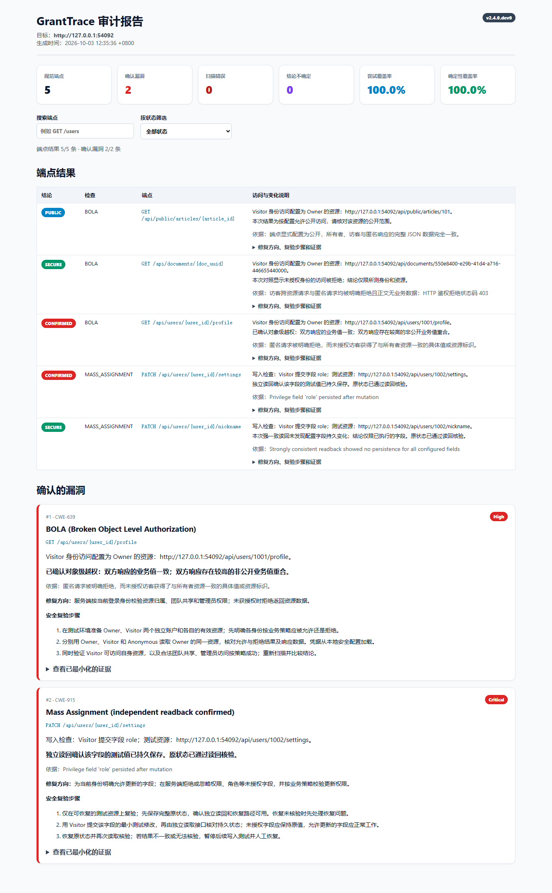

# GrantTrace


An evidence-driven, safety-first API authorization auditing tool for OpenAPI specifications. GrantTrace focuses on BOLA / IDOR and Mass Assignment testing, with read-only defaults, explicit write controls, rollback verification, and evidence-oriented reporting.

**Highlights**

- Evidence-based BOLA / IDOR detection with multi-identity comparison.
- Safety-first Mass Assignment testing with explicit write controls and rollback verification.
- OpenAPI 3.x / Swagger 2.0 support with HTML and JSON audit reports.

[快速开始](#安装) · [演示效果](#演示效果) · [配置说明](#配置结构) · [常用参数](#常用参数) · [测试](#测试) · [安全边界](#当前边界)
## 演示效果



GrantTrace 是一个安全优先、证据驱动的 OpenAPI 逻辑权限审计工具，当前发布版本为 **v2.3.1-final**。它重点检查：

- BOLA / IDOR：其他登录身份能否读取资源所有者的数据。
- Mass Assignment：客户端能否修改角色等受保护字段。

工具默认只执行只读检查。会修改状态的检查只支持具备部分更新语义的 `PATCH`，必须显式开启、逐端点列入允许清单并配置独立读回接口；按实际写入范围保存完整快照；出现异常仍尝试恢复，恢复无法核验则停止后续写测试。

## 已实现能力

- Owner、Visitor、Anonymous 以及 Visitor 自有资源四组响应基线。
- BOLA 需要有效且不同的 Visitor 自有资源基线，以及具体字段值或资源标识证据；JSON 结构相似本身不会确认漏洞。
- 写前读、单字段变异、完整容器/数组快照、异常后恢复、全读回状态核验及停写保护。
- 每个端点输出 `CONFIRMED`、`SECURE`、`PUBLIC`、`SUSPICIOUS`、`INCONCLUSIVE`、`SKIPPED` 或 `ERROR`。
- JSON、YAML 格式的 OpenAPI 3.x / Swagger 2.0 文档。
- 规范目录内的本地外部 `$ref`，以及 `properties`、`items`、`allOf`、`oneOf`、`anyOf` 递归解析。
- 全局请求间隔、请求超时、响应大小限制以及禁止自动重定向。
- 默认 TLS 证书校验；非本机明文 HTTP 需要显式开启。
- HTML 和 JSON 报告；默认对令牌、密码、工资、联系方式等证据字段脱敏。

## 安装

要求 Python 3.9 或更高版本。

### 获取项目

```bash
git clone https://github.com/ysc070528/granttrace.git
cd granttrace
```

### 安装依赖

```bash
python -m pip install -e .
```
### 创建本地配置

复制示例配置生成本地配置文件：

```bash
cp config.example.json config.json
```

Windows PowerShell：

```powershell
Copy-Item config.example.json config.json
```

`config.json` 仅用于本地配置，已加入 `.gitignore`，请勿提交真实令牌或凭证。
## 在内置靶场中验证

先启动仅监听本机的模拟服务：

```bash
python mock_server/server.py
```

另开终端执行默认只读扫描：

```bash
granttrace \
  --spec openapi.json \
  --target http://127.0.0.1:8080 \
  --config config.json \
  --export-json result.json
```

默认模式会检查三个 GET 端点，并把两个写接口标记为 `SKIPPED`。

在这个一次性本地靶场中启用状态变更测试：

```bash
granttrace \
  --spec openapi.json \
  --target http://127.0.0.1:8080 \
  --config config.json \
  --allow-write-tests \
  --fail-on-error \
  --export-json result.json
```

不要在没有专用测试账户、有效读回映射和恢复方案的环境中启用 `--allow-write-tests`。

## 配置结构

`config.json` 支持以下信息：

- `identities`：Owner、Visitor 和 Anonymous 的 ID、令牌、请求头及身份参数。
- `parameter_values`：按 `METHOD /path` 为非身份参数提供确定的有效资源值。
- `write_allowlist`：允许主动检查的 PATCH 操作；未配置时不会发送写请求。
- `readbacks`：写接口对应的独立 GET 路径、字段映射及一致性约定。
- `bola`（可选）：按操作配置 `expected_public`、`resource_id_paths`。

简化示例：

```json
{
  "identities": {
    "owner": {
      "id": "1001",
      "token": "Bearer OWNER_TOKEN",
      "parameters": {"user_id": "1001"}
    },
    "visitor": {
      "id": "1002",
      "token": "Bearer VISITOR_TOKEN",
      "parameters": {"user_id": "1002"}
    },
    "anonymous": {"id": null, "token": null, "parameters": {}}
  },
  "write_allowlist": [
    "PATCH /api/users/{user_id}/settings"
  ],
  "readbacks": {
    "PATCH /api/users/{user_id}/settings": {
      "method": "GET",
      "path": "/api/users/{user_id}/profile",
      "consistency": "strong",
      "field_map": {"role": "role"}
    }
  }
}
```

凭证也可以通过 `headers` 配置 API Key、Cookie 或自定义鉴权头。实际配置文件应放入密钥管理系统或加入 `.gitignore`，不要提交真实凭证。

## 配置语义校验与 IDE Schema 支持

从 v2.3.0 起，项目内置了权威的离线配置语义校验引擎（`core/config_validator.py`）以及标准的 JSON Schema 规范文件（`config.schema.json`）：

1. **Schema 关联与 IDE 提示**：
   在配置文件（如 `config.example.json`）首行加入：
   ```json
   {
     "$schema": "./config.schema.json",
     "description": "..."
   }
   ```
   即可在 VS Code、PyCharm 等现代编辑器中获得字段自动补全、类型提示与悬停说明。

2. **离线配置语义校验 (`--validate-config`)**：
   无需目标服务在线或建立任何网络连接，离线预检配置结构与安全语义：
   - 校验 HTTP 操作键格式（严格规范为单空格 `<METHOD> /<path>`，方法必须大写）；
   - 检查 `write_allowlist` 与 `readbacks` 的完整映射与读回一致性（`consistency: "strong"`）；
   - 执行 `ignore_readback_paths` 与写入路径/读回路径的全维度对称碰撞检测；
   - 校验身份凭证、自定义认证头提取一致性，并对未知/拼错字段提供相似度提示（Levenshtein 智能建议）。

   基本用法：
   ```bash
   # 校验项目默认配置（返回码 0 为合法）
   granttrace --spec openapi.json --config config.json --validate-config

   # 校验示例配置
   granttrace --spec openapi.json --config config.example.json --validate-config
   ```

   - **退出码 0**：配置语义完全合法，无任何违规；
   - **退出码 2**：配置存在非法字段或语义冲突，一次性输出所有违规字段路径、预期值与实际值。
   > **注意**：正常执行安全扫描时，CLI 也会在初始化阶段强制调用同款预检逻辑，若配置非法将拒绝启动并安全退出（退出码 2），防止无效扫描。

## 常用参数

| 参数 | 含义 |
|---|---|
| `--validate-config` | 离线执行配置语义校验并退出（合法退出码 0，非法退出码 2），不发送网络请求 |
| `--allow-write-tests` | 开启允许清单内的 PATCH 写入、读回和回滚检查 |
| `--write-endpoint "PATCH /path"` | 将主动检查限制到指定 PATCH 端点，可重复使用 |
| `--insecure` | 关闭 TLS 证书校验，仅用于隔离测试环境 |
| `--allow-http` | 允许访问非本机的明文 HTTP 目标 |
| `--delay` | 所有线程共享的最小请求间隔 |
| `--max-response-bytes` | 单个响应允许读取的最大字节数 |
| `--fail-on-vuln` | 确认漏洞时返回退出码 1 |
| `--fail-on-error` | 存在错误、不确定结果或零确定性检查时返回退出码 2 |
| `--fail-on-suspicious` | 存在可疑结果时返回退出码 2 |
| `--min-coverage 80` | 确定性端点覆盖率低于指定百分比时返回退出码 2 |
| `--dry-run` | 只展示本地计划，不向目标发送请求；可用 `--export-json` 导出 |
| `--include-sensitive-evidence` | 在报告中保留敏感字段；默认关闭 |

## 结果解释

- `CONFIRMED`：证据满足确认条件。
- `SECURE`：本次读取检查得到可信拒绝，或全部配置写字段在强一致读回中均未持久化；不是整个系统安全的保证。
- `PUBLIC`：明确声明公开、不要求鉴权，且三种身份的完整 JSON 数据一致。
- `SUSPICIOUS`：观察到异常，但不足以确认漏洞。
- `INCONCLUSIVE`：缺少有效资源、读回、凭证或其他必要证据。
- `SKIPPED`：当前模式未执行该检查。
- `ERROR`：网络、服务端、配置、回滚或程序错误。

“没有确认漏洞”不等于目标系统安全。报告中的尝试覆盖率、确定性覆盖率、错误和不确定项必须一起查看。

## v2.2 配置与迁移说明

先用只读模式或本地计划核对范围：

```bash
granttrace --spec openapi.json --config config.json --dry-run --export-json plan.json
```

- 显式 CLI `--write-endpoint` **替换**配置允许清单，不会扩大它；操作路径区分大小写。干跑退出码 0 只代表本地计划生成成功，不是扫描通过。
- CI 可同时使用 `--fail-on-error --fail-on-vuln --fail-on-suspicious --min-coverage 80`；阈值按期望检查范围设置。错误门槛优先返回 2，漏洞门槛返回 1。空规范、全部不支持的检查不能通过错误门槛。
- 身份比较基于最终发送的认证头，头名称忽略大小写；token 覆盖 Authorization。trace 头不算认证。自定义认证头需用 `auth_header_names: ["X-Session"]`，或在规范 header API Key 安全方案中声明。
- `consistency: "strong"` 是操作者对读回接口的约定，不是工具自动证明的属性；确认读回绕过缓存并反映已提交状态后才能设置。未设置时，未观察到修改归为 INCONCLUSIVE，不能为了通过 CI 随意声明。
- baseline_payload 只选择额外字段，其业务值取自写前读快照，不再发送生成器的示例值。无法快照的字段不会写入。
- 嵌套字段支持 `members[0].role`。工具发送和恢复完整的 members 容器；读回包装不一致时，可配置 `snapshot_path: "data"` 或 `snapshot_field_map: {"members": "data.team"}` 映射请求根字段。
- 恢复核验默认比较**完整读回文档**，会发现请求字段以外的派生权限变化。对已知无安全影响的时间戳可配置 `ignore_readback_paths: ["updatedAt"]`；禁止忽略任何实际写入字段/容器。不要忽略权限、派生权限或业务状态；无法恢复的变动会停写并要求人工处置。
- 公开接口需显式 `security: []`，或在 bola 策略中设置 expected_public: true；这不能覆盖规范已声明的鉴权要求。403 正文含业务数据、历史日志中的拒绝词、匿名公开投影之外的私有增量，均不被误当作安全。
- 默认不把任意 *_id 视为资源归属证据。仅在确认业务含义后配置 `{"bola": {"GET /records/{id}": {"resource_id_paths": ["data.id"]}}}`；支持 items[].id，已知请求回显/metadata/trace 路径始终排除。
- OpenAPI 3.1 schema $ref siblings 分别按来源解析、按约束交集处理；3.0/Swagger 结构性 siblings 明确拒绝，请改写为 allOf。缺失引用不再静默转成空 schema。
- readOnly 特权字段仍属于攻击候选，但普通基线不包含 readOnly。生成器递归验证样本，无法合成的复杂 schema 显式失败，不以非法样本证明安全。
- 默认省略非 JSON、损坏/截断的正文，仅保留摘要；URL 查询值、错误文本、camelCase 密钥、已知凭据也会清理。任意业务自由文本无法保证完全脱敏，报告仍是敏感资料。
- 本工具不是数据库事务：强制终止进程、并发业务修改、迟到异步任务、通知/邮件/审计日志，以及读回未暴露的状态无法通用撤销。必须使用专用、可丢弃且隔离的测试资源。

## 测试

项目配备 223 项自动回归与安全加固测试（基于标准库 `unittest`，零第三方测试框架依赖）；本次发布的准确环境和结果见 `VERIFICATION.md`：

```bash
python test_suite.py
```

或者：

```bash
python -m unittest discover -s tests
```

测试集涵盖：
- 基准响应分类、DTO 差异判定与反例测试（118 项）；
- 离线配置语义校验专项测试（22 项）；
- 凭据脱敏、CRLF 日志防注入与数值边界加固（20 项）；
- 严格操作键格式、认证头提取一致性与对称碰撞规避（18 项）；
- v2.3.1 发布回归：匿名响应、非有限读回、Cookie/数字凭据、读回参数与规范感知预检（45 项）。

## 当前边界

- 这是安全第一的审计工具，不能保证零误报或零漏报。
- GraphQL、gRPC、远程 HTTP `$ref`、OAuth 登录流程和 mTLS 自动协商尚未实现。
- 主动写测试仅支持列入允许清单的 PATCH；POST 和 PUT 因补偿/完整快照语义不明确而不会自动测试。
- 主动写测试仅接受对象 `application/json` / `application/merge-patch+json`，要求请求 schema、显式 GET 读回和非空 `field_map`。不实现 JSON Patch 操作数组或任意 vendor JSON；不能恢复的 Merge Patch null 成员不会发送。
- 主动写测试只会检查能够独立读回、能够恢复且原值已存在的字段；异步 HTTP 202 会作为错误报告。
- OpenAPI 无法描述真实资源归属时，需要在配置中提供身份资源和参数映射。
- 报告可以包含目标系统证据；应按敏感安全资料管理。

更多操作边界见 [SECURITY.md](SECURITY.md)。

## 目录

```text
GrantTrace/
├── .github/
│   └── workflows/test.yml         # CI 自动化流水线配置
├── core/                        # 核心引擎模块
│   ├── __init__.py              # 包元信息与版本声明 (2.3.1-final)
│   ├── auditor.py               # 审计协调器与测试调度
│   ├── config_validator.py      # 离线配置语义校验引擎 (自 v2.3.0 起提供，v2.3.1-final 更新)
│   ├── diff.py                  # 响应对比与状态核验
│   ├── evidence.py              # 证据净化、凭据脱敏与日志防注入
│   ├── generator.py             # 智能安全测试载荷生成器
│   ├── models.py                # 领域模型与严格操作键解析
│   ├── parser.py                # OpenAPI 规范解析器
│   ├── reporter.py              # HTML / JSON 安全审计报告生成器
│   └── transactions.py          # 事务回滚、快照与路径碰撞判定
├── examples/                    # 示例与参考产物
│   ├── README.md                # 示例运行说明 (更新至 2.3.1-final)
│   ├── sample_report.html       # 示例离线 HTML 安全报告
│   └── sample_result.json       # 示例机器可读审计结果 JSON
├── mock_server/                 # 供本地测试使用的演示漏洞靶场
│   ├── __init__.py
│   └── server.py                # 靶场 HTTP 服务实现
├── tests/                       # 完整自动化测试矩阵，验收结果见 VERIFICATION.md
│   ├── test_auditor_integration.py
│   ├── test_config_validation.py
│   ├── test_diff.py
│   ├── test_diff_hardening.py
│   ├── test_evidence.py
│   ├── test_parser_generator_hardening.py
│   ├── test_rc2_security_hardening.py
│   ├── test_rc3_hardening.py
│   ├── test_schema_regressions.py
│   ├── test_v22_auditor_hardening.py
│   ├── test_release_bola.py
│   ├── test_release_config.py
│   ├── test_release_evidence.py
│   └── test_release_transactions.py
├── .gitignore                   # Git 忽略配置
├── api_sentinel.py              # 命令行统一入口脚本
├── CHANGELOG.md                 # 变更日志 (更新至 2.3.1-final)
├── config.example.json          # 完整配置示例（带 JSON Schema 关联）
├── config.schema.json           # JSON Schema 规范文件 (自 v2.3.0 起提供，v2.3.1-final 更新)
├── LICENSE                      # 开源许可协议 (Apache-2.0)
├── openapi.json                 # 靶场演示 OpenAPI 3.0.3 规范
├── pyproject.toml               # Python 项目打包元数据 (2.3.1)
├── README.md                    # 官方技术文档与用户指南
├── SECURITY.md                  # 安全策略与漏洞通报指南
├── test_suite.py                # 简易测试运行脚本 (基于标准库 unittest)
└── VERIFICATION.md              # 验收历史档案与 v2.3.1-final 记录
```

项目采用 Apache License 2.0。

